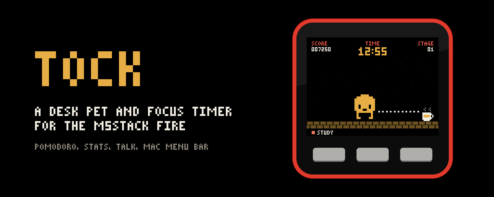

  

  <ul>
<h1>Tock</h1>
</ul>

A simple pet project of how I'd like to focus.

Tock is a desk pet and focus timer for the [M5Stack FIRE](https://docs.m5stack.com/en/core/fire).
A small pixel creature lives on the screen and keeps you company while you work: it counts down
your focus time, has a coffee on your breaks, and cheers when you reach your daily goal.

- **Timer**: one countdown, Pomodoro, or intervals, in four looks. The LEDs fill as time runs.
- **Stats**: today, the week, and a 16-week heatmap, split by task if you use tasks.
- **Talk**: hold a button and talk to Tock (an OpenAI voice model, straight from the FIRE).
- **Saver**: your own lines, large, over a slow background.
- **Mac app**: Tock in your menu bar, today's goal and progress, and a log of your focus on the Mac.

The FIRE works on its own; the Mac app pairs over Bluetooth for setup (tasks, Wi-Fi, the API key)
and for the menu bar.

> [!NOTE]
> Tock is a pre-release project, so be kind and patient with it. Things may break or change
> between versions; if something does, [open an issue](https://github.com/hesamsheikh/tock/issues).

## Install

You need an M5Stack FIRE and a Mac with macOS 15 or later.

    firmware/flash.sh            # build the firmware and flash it over USB
    companion/build.sh install   # build the Mac app and put it in /Applications

Then switch Bluetooth on in the FIRE's Settings and type the code it shows when the Mac asks.
After that, updates come through the Mac app, for the app and the FIRE both.
[Getting started](docs/getting-started.md) has the details: what to install first, Wi-Fi, and
the API key for Talk.

## Docs

- [Getting started](docs/getting-started.md): flashing, the Mac app, pairing, Wi-Fi
- [Using Tock](docs/using-tock.md): the buttons, the apps, tasks, the menu bar
- [Firmware](docs/firmware.md): how the code is laid out, building, serial debug commands
- [Releasing](docs/releasing.md): versions, and the updates the Mac app installs
- [Bluetooth protocol](docs/bluetooth.md): the service the Mac app talks to
- [Mac app](companion/README.md)

## Layout

    firmware/    the FIRE's firmware (Arduino, ESP32) and its build scripts
    companion/   the Mac menu bar app (SwiftUI, built without Xcode)
    docs/        these docs
    release.sh   publishes a release (docs/releasing.md)

## License

[MIT](LICENSE). Changes: [CHANGELOG](CHANGELOG.md).
